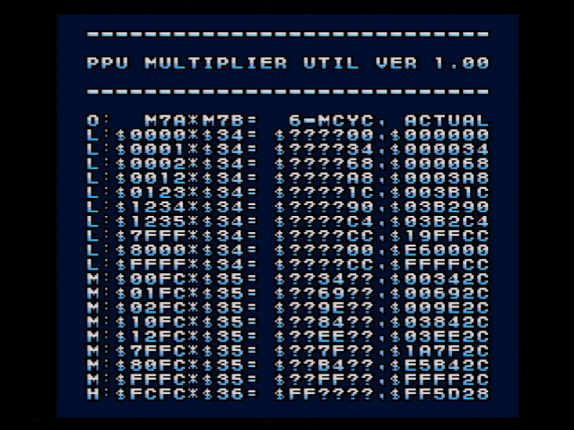

# PPU multiplier utility  

**It is a utility ROM that does not judge.**  

It displays the result of accessing the PPU multipler calculation result in 1 CPU cycle (6 master cycles).  

## Test details  

It abuses memory accesses via the `$FC JSR (abx, X)` instruction and Openbus.  

[PoC](https://absindx.github.io/SnesMasterCycleViewer/?rm=lo&fr=0&sfe=0&sa=008000&mc=10000&esw=1&esb=1&esc=1&esr=0&zsrc=TTdCJTA5JTNEJTIwJTI0MjExQyUwQU1QWUyBazM0gWCAIjmAIC5tOIGALmk4gRBTdGFydCUzgZRSRVCAgTIzg1AxMIMHaTE2gMZMRFiCM4fBhfGAUTGB5lRYU4KvhKOBVEpNidIyNDA1MDAwhACENItiMjAtgDCK5y5vcmeC1DAwNY1SgrFPUkGNs4ExgnJkYoJjRpAQgkRKU1KAUChhYnglMkOAkFgphW-IQoMxhEN3i1FhbmRpboHggr-LAzBBgiWTcY63LoPRk8QylySBoVNUlVBB)  

`M7B` depends on the program counter and cannot be changed.  

Unfortunately, it was not possible to observe the process of calculation with PPU Multiplier.  
However, it may be applicable to other I/O registers.  

## For automated testing  

The test ends when address `$000000 (TestFinished)` becomes non-zero.  
The meaning of the value of this address is `0=Running, 1=Finished` .  

See [RamMap.asm](RamMap.asm) for other memory usage.  

## Test environment  

* SNES:  
  * Super Famicom (NTSC-J)  
  * Board: `SNSRGB01`  
* LoROM cartridge:  
  * Board: `SHVC-1A0N-20`  

### Hardware result  

