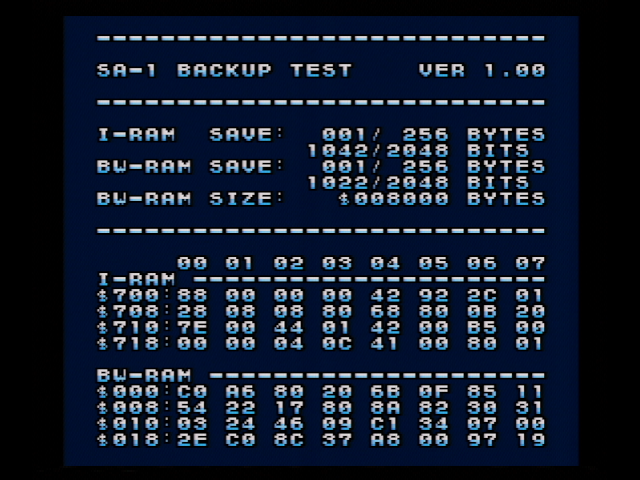

# SA-1 backup utility  

**It is a utility ROM that does not judge.**  

At startup, I-RAM and BW-RAM display the number of bytes/bits that match the expected value.  
It then writes the expected values to those memories.  
This allows checking to see if the memory is battery backed up.  

## Test environment  

* SNES:  
  * Super Famicom  
  * Board: `SNSRGB01`  
* SA-1 cartridge:  
  * Board: `SHVC-1L5B-20`  
    * Chip: `RF5A123 / 6LF 8Y`  
  * Board: `SHVC-1L0B-01`  
    * Chip: `RF5A123 / 5GF 7N`  

### Hardware result  

  
[SHVC-1L0B-01 I-RAM Volatize](https://www.youtube.com/watch?v=beJ3SHh4Ngo) (YouTube)  

