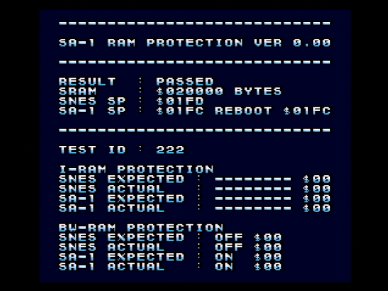

# SA-1 RAM protection test  

  

Testing SA-1 I-RAM Protection and BW-RAM Protection.  

## Required  

Uses IRQ from SA-1 to SNES CPU for sending test data.  

* `$220E-$220F SIV`  
* `$2209 SCNT.IVSW`  
* `$00FFEE NativeMode IRQ`  

## Notes  

See [MessageID.asm](MessageID.asm) for TEST ID assignment.  

* TEST ID : 35, 38  
  BW-RAM Protection will not be reflected unless protection is enabled on both SNES and SA-1.  
* TEST ID : 52-56, 104-108  
  Even if a value larger than `$0A` is written to `BWPA`, the effective range of BW-RAM Protection is up to `$43FFFF`.  
* TEST ID : 93-144  
  BW-RAM Protection's `BWPA` is a register for the SNES CPU, but it also affects the SA-1 protection area.  
* TEST ID : 145-162  
  It seems that the unmapped area on the SA-1 side returns the old data bus value. (similar to PPU open bus...?)  
  (Probably) The initial value is an undefined value for a cold boot, and the previous value for a momentary power off or reset button.  
  Macro `%SetSa1Databus()` sets the bus to any value.  
  Since the details are still unknown, I plan to create another test ROM.  

### TODO  

It may be a bug in the test program or unexplained behavior.  

* Test system  
  It may randomly get stuck during testing or the test may fail.  
  Missing the IRQ from SA-1 to SNES CPU?  
  I don't have any statistics, but it often happened when I turned it off for a few seconds and then started it up.  
* TEST ID : 211, 213, 215  
  Even if SA-1 is stopped with CWEN=1, will writing to BW-RAM with SWEN=0 be protected.  
  Has it been reset at some point?  
  (From the behavior of TEST ID : 35, 38)  
* TEST ID : 221  
  SA-1 I-RAM Protection after reset returns protection status $00.  
  Has it been reset at some point?  

## For automated testing  

The test ends when address `$000000 (TestFinished)` becomes non-zero.  
The meaning of the value of this address is `0=Running, 1=Passed, 255=Failed` .  

See [RamMap.asm](RamMap.asm) for other memory usage.  

## Debug builds  

Enabling the `!DEBUG` definition in [Main.asm](Main.asm) enables debugging functionality.  
Pressing Player 1's A button will ignore the failed test and display the next test result.  

## Test environment  

* SNES:  
  * Super Famicom  
  * Board: `SNSRGB01`  
* SA-1 cartridge:  
  * Board: `SHVC-1L5B-20` [(A4WJ expanded to 1MBit of SRAM)](https://absindx.github.io/ZpIndIndY/Articles/SnesSA1Cartridge/)  
  * Chip: `RF5A123 / 6KD 80`  

